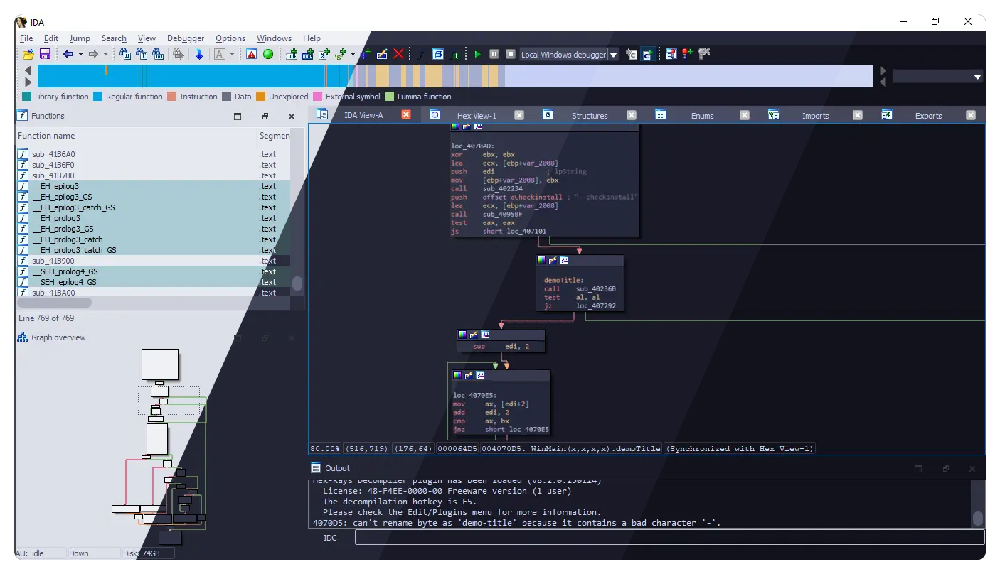
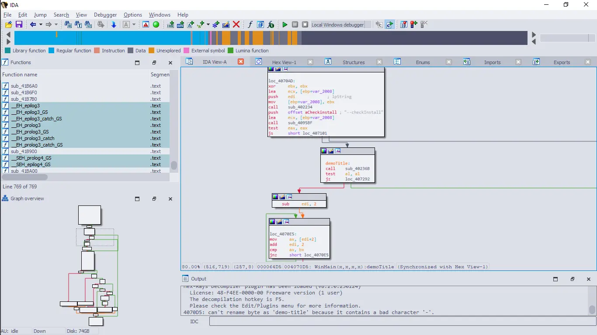
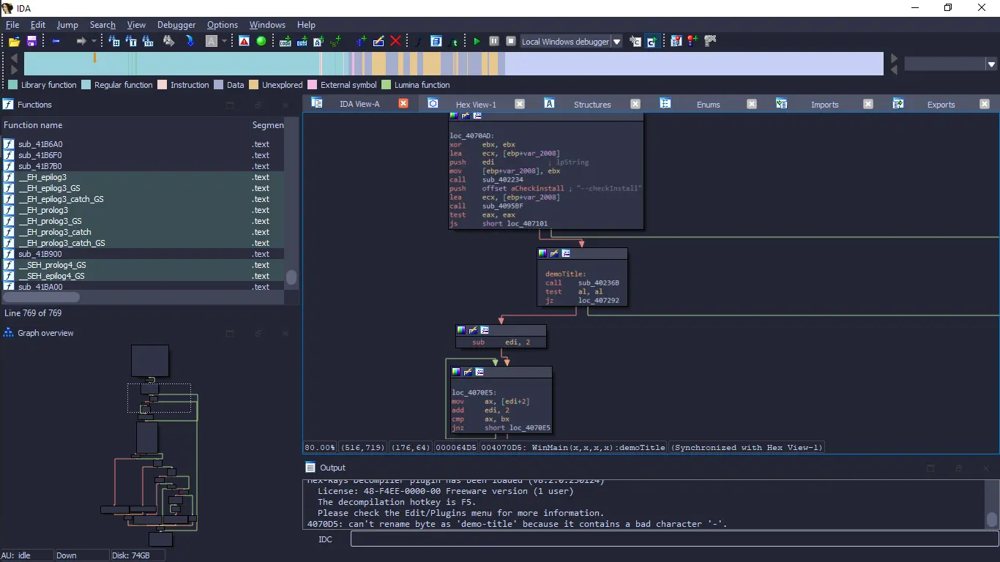
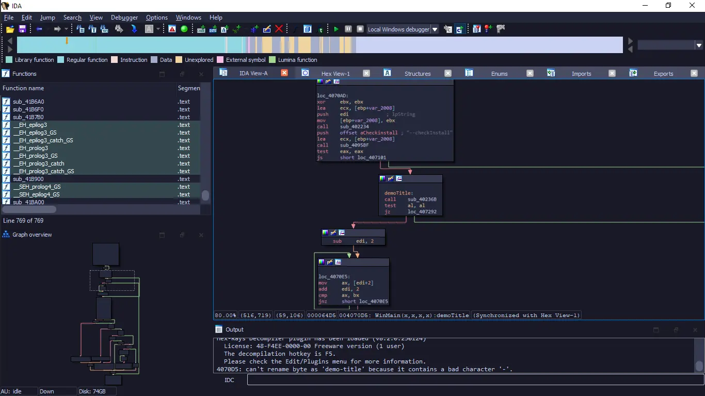
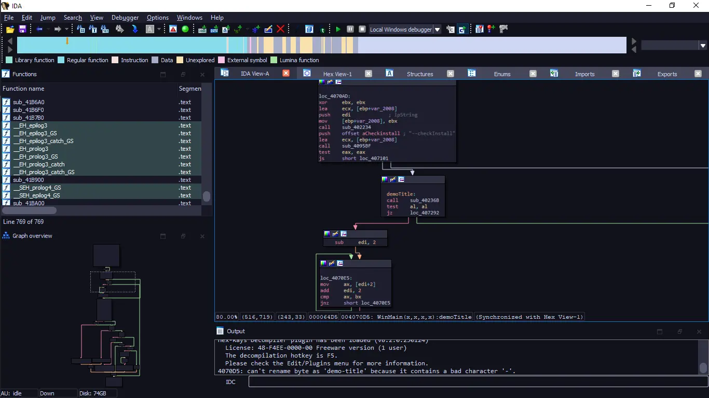

<h3 align="center">
	<br/>
	
	Catppuccin for <a href="https://hex-rays.com/ida-pro/">IDA (Interactive Disassembler)</a>
	
</h3>

<p align="center">
	<a href="https://github.com/ValentinTT/ida-debugger/stargazers"></a>
	<a href="https://github.com/ValentinTT/ida-debugger/issues"></a>
	<a href="https://github.com/ValentinTT/ida-debugger/contributors"></a>
</p>

<p align="center">
	
</p>

## Previews

<details>
<summary>🌻 Latte</summary>

</details>
<details>
<summary>🪴 Frappé</summary>

</details>
<details>
<summary>🌺 Macchiato</summary>

</details>
<details>
<summary>🌿 Mocha</summary>

</details>

## 🔧 Usage

1. **Download** the GitHub repository as a .zip file and unzip it. Alternatively, you can **clone** the repository using the following command in your terminal:

   ```bash
   git clone https://github.com/ValentinTT/ida-debugger.git
   ```

2. **Move** the four `catppuccin-[flavour]` folders into the `/themes` folder inside IDA's installation folder. This folder may be read-only, so ensure you have the necessary permissions.

   If you prefer, you can also refer to [IDA's official documentation](https://hex-rays.com/products/ida/support/tutorials/themes/) for detailed instructions on adding themes.

## 🔌 Activation

1. **Open** IDA and navigate to `Options -> Colors... -> Current theme`.

2. **Select** any of the four flavors of Catppuccin from the available themes.

## 🙋 FAQ

- Q: **_"Where can I find the `/themes` folder?"_**

  - A: The location of the `/themes` folder depends on your operating system. Here are the default installation folder locations for IDA Pro:

    - **Windows:**

      - 32-bit version: `C:\Program Files\IDA-{version}\`
      - 64-bit version: `C:\Program Files (x86)\IDA-{version}\`

    - **Linux:**

      - `/opt/ida-{version}/`

    - **macOS:**
      - `/Applications/IDA-{version}/`

    Replace `{version}` with the specific version number of IDA Pro you have installed.

## 💝 Thanks to

- [ValentinTT](https://github.com/ValentinTT)

&nbsp;

<p align="center">
	
</p>

<p align="center">
	Copyright &copy; 2021-present <a href="https://github.com/catppuccin" target="_blank">Catppuccin Org</a>
</p>

<p align="center">
	<a href="https://github.com/catppuccin/catppuccin/blob/main/LICENSE"></a>
</p>
